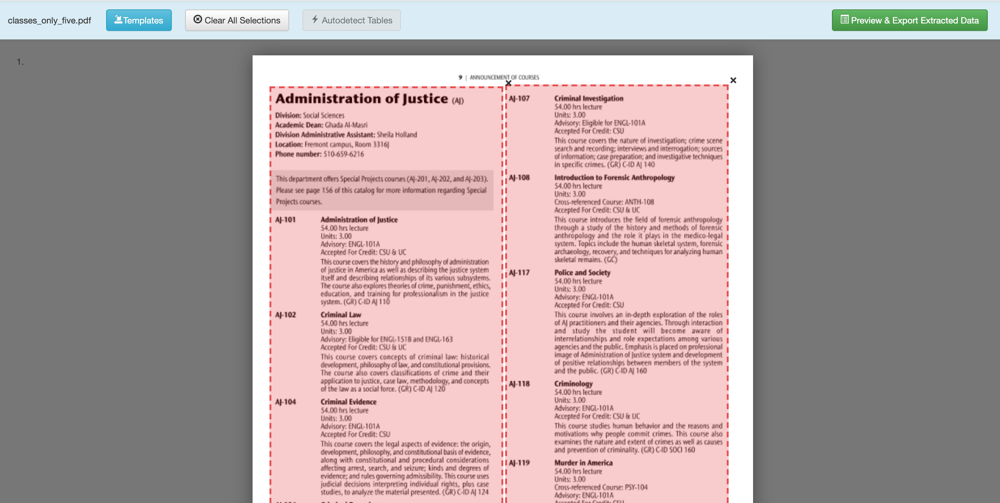

# CSVcompiler

The CSV Compiler reads in some CSV generated by Tabula for some pages of the
Ohlone catalog and generates a JSON object with that resulting information.

<br>

### How do I compile an Ohlone Catalog?

Prepare a PDF of the pages you would like to scrape
from.


 - First download <a href = "https://tabula.technology/">Tabula</a>.
 - Run Tabula on your pages of the catalog (importing them) and place one selection on the left side of the page and the other selection on the right side of the page. Repeat the selections.
 </img>
 - Extract your data to a CSV file and place into a local folder next to compiler.py. (If you're curious what your file should look like, checkout the sample data.csv file)
 - Run the following line in your terminal (replacing the names with your CSV and output JSON file):
 ```
 python3 compiler.py data.csv data.json
 ```

 Continue the compilation by running a cleaner to make the data into a usable format for the website.
 Run 
 ```
 python3 cleaner.py data.json cleaned_data.json.
 ```
 The above line will require input from you through the terminal to describe the full name of every division and class area. It's simple! Just check out the pdf you were compiling originally. Take note of the "Class Area", for example "AJ" for Administration of Justice. Your job is that, when the computer asks for the full name of one of these area, you just input it correctly. Then, if this area is new provide the division that it belongs in. If it belongs in a new division, give the name to that division.

 Use the cleaned_data.json as needed (by placing it in the website's data folder).